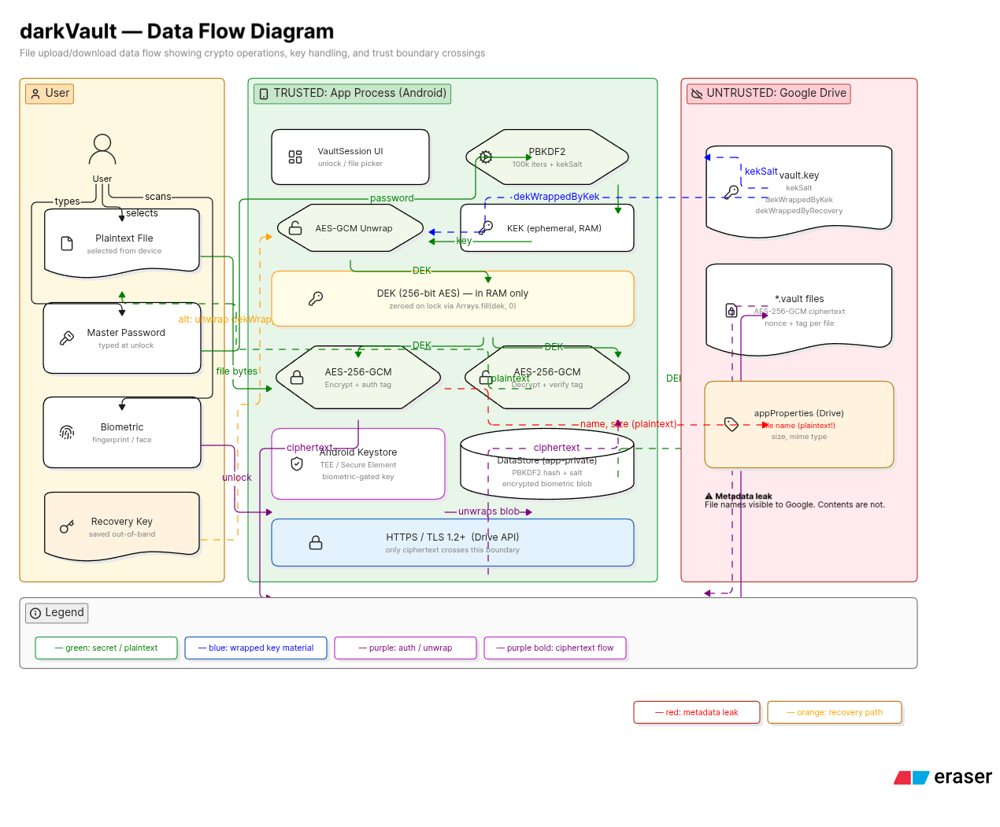
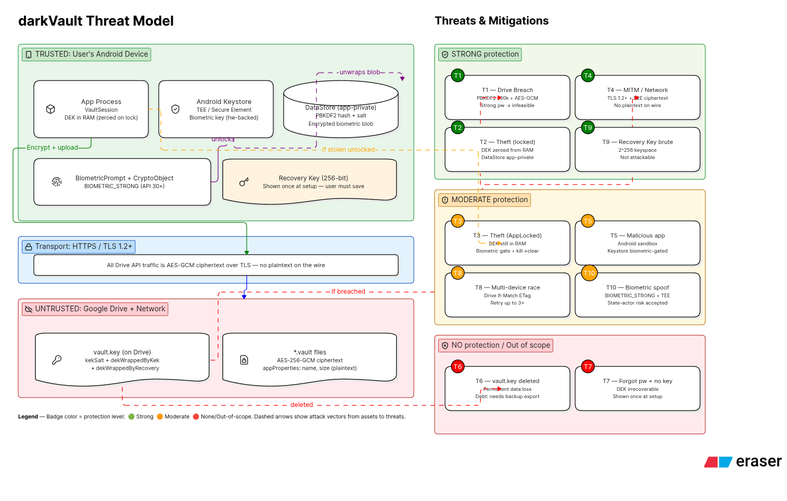
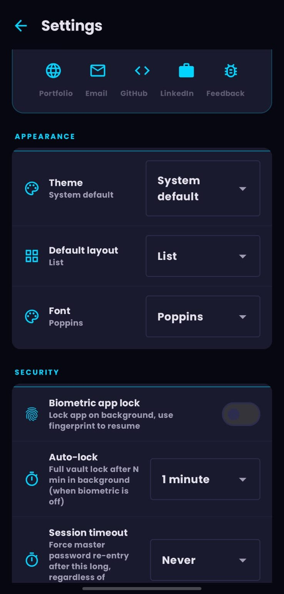
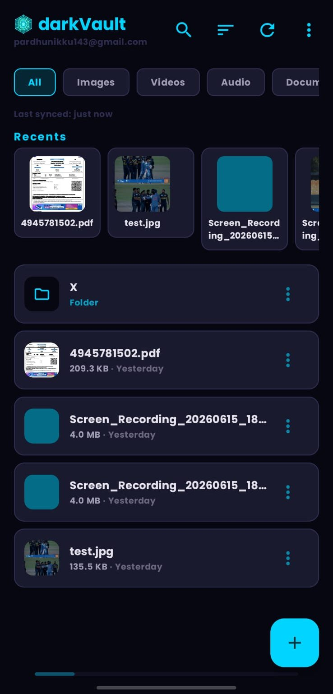
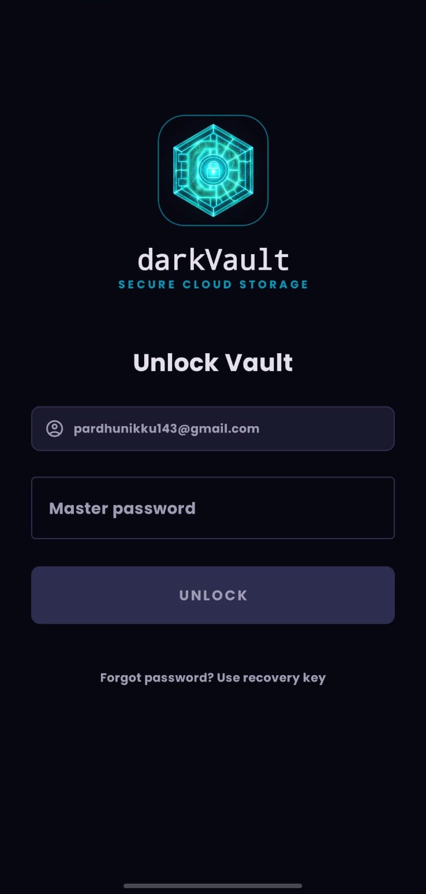

# darkVault

**AES-256-GCM encrypted personal backup for Google Drive.**  
Your files are encrypted on your device before they ever reach Google's servers. Not even Google can read them.

---

## What darkVault does

darkVault is a private Android app that lets you back up your files to Google Drive in a way that keeps them completely private. Every file is scrambled using military-grade encryption before it leaves your phone. The only way to unscramble them is with your master password — a secret that never leaves your device.

---

## Pages

| Page | Who it's for |
|------|-------------|
| [User Guide](./user-guide.md) | Anyone using the app — no technical knowledge required |
| [Encryption Architecture](./encryption.md) | Developers — full crypto implementation and data flow |
| [Threat Model](./threat-model.md) | Developers & security reviewers — what we protect against and known limits |
| [FAQ](./faq.md) | Everyone — common questions answered |

---

## Key properties

- Files are encrypted with **AES-256-GCM** — a standard used by banks, governments, and major cloud providers
- Your password is **never stored** — not on your phone, not on Google Drive, nowhere
- A **Recovery Key** is generated at setup so you can regain access even if you forget your password
- Encryption and decryption happen entirely **on your device**; Google only ever sees scrambled bytes
- **Zero dependencies** on external crypto libraries — uses Android's built-in `javax.crypto` only

---

## Security at a glance

```
Your Password
     │
     ▼  PBKDF2 — 100,000 rounds of SHA-256
    KEK  (Key Encryption Key — exists only in RAM during unlock)
     │
     ▼  AES-256-GCM unwrap
    DEK  (Data Encryption Key — random, lives only in RAM after unlock)
     │
     ▼  AES-256-GCM per file
  Encrypted .vault files on Google Drive
```

The DEK is the actual key that encrypts your files. It is itself encrypted (wrapped) by your password and stored in `vault.key` on Drive. When you lock the app, the DEK is zeroed from RAM — nothing sensitive persists on-device.

---

## Diagrams

### Data Flow
[](./encryption.md)

### Threat Model
[](./threat-model.md)

---

## Screenshots
<table>
  <tr>
    <td align="center">
      <br>
      <b>Settings Screen</b>
    </td>
    <td align="center">
      <br>
      <b>Home Screen</b>
    </td>
    <td align="center">
      <br>
      <b>Login Screen</b>
    </td>
  </tr>
</table>

---

## Privacy Policy

📄 [Download the Privacy Policy (DOCX)](./privacy/darkVault_Privacy_Policy.docx)

## Source

[github.com/scap3sh4rk/darkVault](https://github.com/scap3sh4rk/darkVault)
